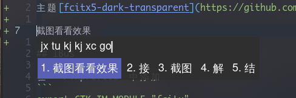

## fcitx5

又换到了 fcitx5, 这个好像要好用的多呀

主题[fcitx5-dark-transparent](https://github.com/hosxy/fcitx5-dark-transparent)

配置和下面的一样, 对应的修改为`fcitx5`就可以了

```
export GTK_IM_MODULE=fcitx5
export QT_IM_MODULE=fcitx5
export XMODIFIERS="@im=fcitx5"
fcitx5 & # 如果不能自启动，加上这个
```

看一张效果图


## IBus

在 `~/.xprofile` 中添加
```
export GTK_IM_MODULE="fcitx"
export XMODIFIERS="@im=fcitx"
export QT_IM_MODULE="fcitx"
```

rime 配置路径`~/.config/ibus/rime/`

## fcitx 输入法的配置

在 `/etc/profile` 中添加
```
# fcitx
export XMODIFIERS="@im=fcitx"
export GTK_IM_MODULE="fcitx"
export QT_IM_MODULE="fcitx"
```

在 `~/.xprofile` 中添加

```
#fcitx
export GTK_IM_MODULE=fcitx 
export QT_IM_MODULE=fcitx 
export XMODIFIERS="@im=fcitx"

export SAL_USE_VCLPLUGIN=gtk fcitx
```

### 搜狗输入法占用过高

Fcitx Configuration > Addon Config > Show Advance option > module > uncheck 'Sogou Cloud Pinyin'
