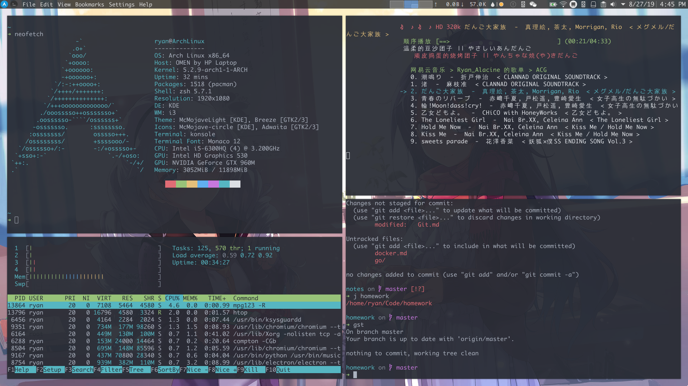

# my_config

## vim (neovim)

刚从 vim 转 neovim, 用的还是原来 vim 的配置, 在 neovim 的配置文件(`~/.config/nvim/init.vim`)中设置使用 vim 的配置

## zsh

[oh-my-zsh](https://github.com/robbyrussell/oh-my-zsh), 主题使用 [spaceship-prompt](https://github.com/denysdovhan/spaceship-prompt)

## tmux

## DE (桌面环境中用到的配置)

* 软件包
* 桌面主题, 部分软件主题
    - i3
    - plasma

