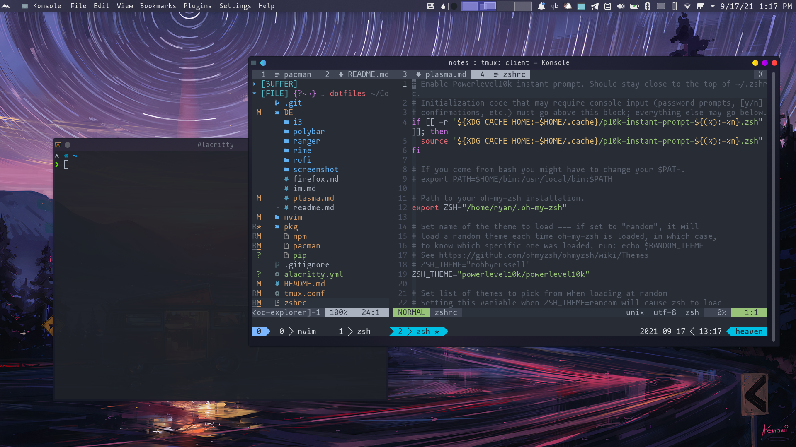

# dotfiles

## neovim

## zsh

[oh-my-zsh](https://github.com/robbyrussell/oh-my-zsh)

主题使用 [powerlevel10k](https://github.com/romkatv/powerlevel10k)

## tmux

## pkg

1. pacman 包
2. pip 包
3. npm 包

## alacritty

## DE (桌面环境中用到的配置)

* 桌面主题, 部分软件主题
    - ~~i3~~
    - KDE plasma




## 新增离线 neovim 的安装 Makefile

打包本地的 neovim 以及插件（暂不包含 coc 插件，后续增加，并增加 tmux 等的配置）
```bash
make
```

解压安装
```bash
tar -zxvf neovim.tar.gz
make install
```
