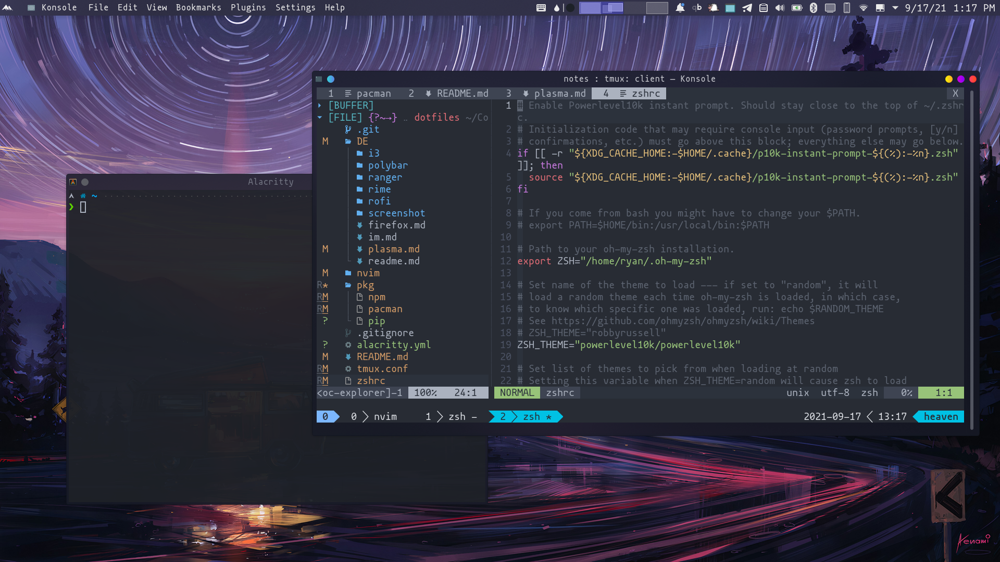

# dotfiles

管理配置文件

- 软件包清单
    - [x] pacman 包
    - [x] pip 包
    - [ ] npm 包
- systemd 后台服务
- 常用软件配置(如 neovim、tmux)
    - [x] 直接托管配置文件或目录
    - [ ] 需安装后配置
- 服务器服务配置
    - [x] frp

### zsh

使用 zsh 原生补全和历史记录，配合 fzf、zoxide。

提示符使用 Starship，与 Nushell 共用 `userhome/.config/starship.toml`。
配置通过 `make deploy` 部署，无需安装 oh-my-zsh 或 Powerlevel10k。

### Ghostty

通用配置位于 `userhome/.config/ghostty`。macOS 专用配置位于
`userhome-macos/.config/ghostty`，只会在 Darwin 上由 `make deploy` 部署。

## 下面的还没改为配置或脚本

### DE (桌面环境中用到的配置)

- 桌面主题, 部分软件主题
    - KDE plasma
    - Hyprland

