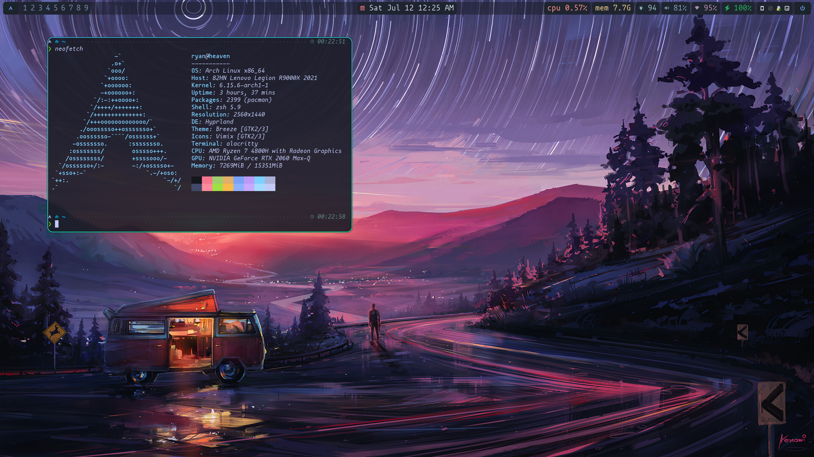

# dotfiles

管理配置文件

- 软件包清单
    - [x] pacman 包
    - [x] pip 包
    - [ ] npm 包
- systemd 后台服务
- 常用软件配置(如 neovim、tmux)
    - [x] 直接托管配置文件或目录
    - [ ] 需安装后配置
- 服务器服务配置
    - [x] frp

## 下面的还没改为配置或脚本

### zsh

[oh-my-zsh](https://github.com/robbyrussell/oh-my-zsh)

主题使用 [powerlevel10k](https://github.com/romkatv/powerlevel10k)

### DE (桌面环境中用到的配置)

- 桌面主题, 部分软件主题
    - KDE plasma

